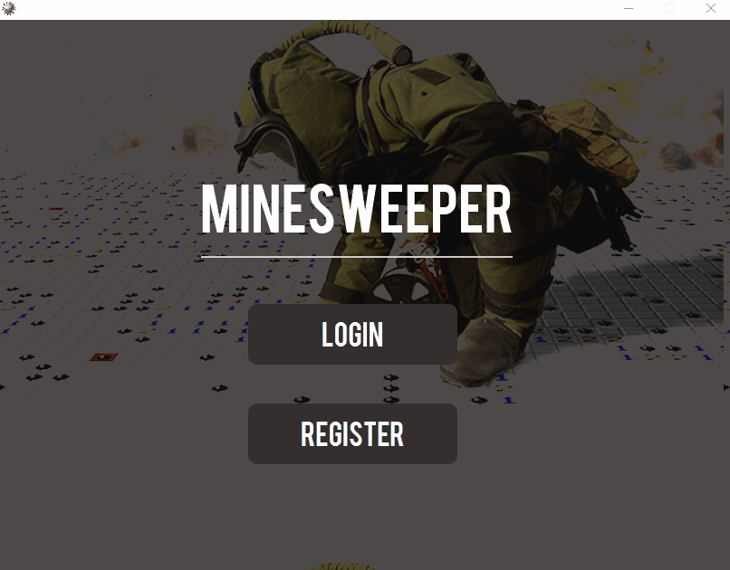

# Distributed Minesweeper

## Main Concept

* In this project we use standalone implementation of Minesweeper Game developed by Sorin.
* We developed the distributed Minesweeper using the Remote Method Invocation(RMI).
* We used JavaFx and Java Swing for GUIs.

## Getting Started

### Prerequisites

* Python for server(SimpleHTTPServer).
* Postgres to store players information. 

**Create database**
```
createdb -DMinesweeper -Upostgres
```

**Create table**
```
CREATE TABLE Players(id Serial PRIMARY KEY,username varchar(20),gameswon int,gameslost int,password text);
```

### To run the Server

1. Run the script **runpython**
2. Run the script **runregistry**
3. Run the script **runserver**

### To run the Client

1. Run the script **runclient**

## Demonstration




## Authors

* **Filipe Mesquita** - [filipemes](https://github.com/filipemes)

* **Pedro Costa** - [pedrooct](https://github.com/pedrooct)

* **Paulo Bento** - [paulobento10](https://github.com/paulobento10)


